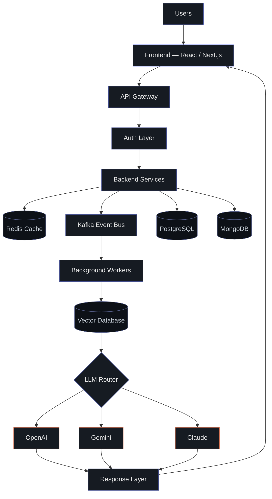

 

# Rafia Malik

<h3>AI Engineer &nbsp;·&nbsp; Backend Engineer &nbsp;·&nbsp; Full Stack Engineer</h3>

  

I design and build backend systems, distributed architectures, and AI-powered products —
from API design and event-driven services to retrieval-augmented generation and agentic workflows.

 

  

 

## About

I work across the stack, but my focus is backend architecture and AI infrastructure — services that need to
stay reliable under load, and AI systems that need to stay grounded in real data. I've spent most of my time
in three areas: designing APIs and distributed services, building retrieval and agent pipelines on top of
LLMs, and shipping the full stack around them when a product needs to exist end to end.

I care about clean architecture, event-driven design, and systems that are easy to reason about six months
after they were written.

**Areas of focus**

`Large Language Models`  `AI Agents`  `Retrieval-Augmented Generation`  `Distributed Systems`
`Cloud Computing`  `Backend Architecture`  `API Design`  `Microservices`  `Performance`  `Open Source`

 

## Engineering Domains

<table>
<tr>
<td width="200"><b>AI Engineering</b></td>
<td>

</td>
</tr>
<tr>
<td><b>Backend Engineering</b></td>
<td>

</td>
</tr>
<tr>
<td><b>Frontend</b></td>
<td>

</td>
</tr>
<tr>
<td><b>Databases</b></td>
<td>

</td>
</tr>
<tr>
<td><b>Distributed Systems</b></td>
<td>

</td>
</tr>
<tr>
<td><b>Cloud &amp; DevOps</b></td>
<td>

</td>
</tr>
<tr>
<td><b>Automation</b></td>
<td>

</td>
</tr>
<tr>
<td><b>Languages</b></td>
<td>

</td>
</tr>
</table>

 

## How I Work

A representative shape of how I architect AI-backed products — request in, grounded response out.

 

## Open Source

I contribute to and maintain projects across backend tooling and AI infrastructure. Active contributions and
repository activity are reflected in the graph below.

 

## GitHub Analytics

 

 

 

<pre>
$ ship()

→ one service at a time.
</pre>

 

